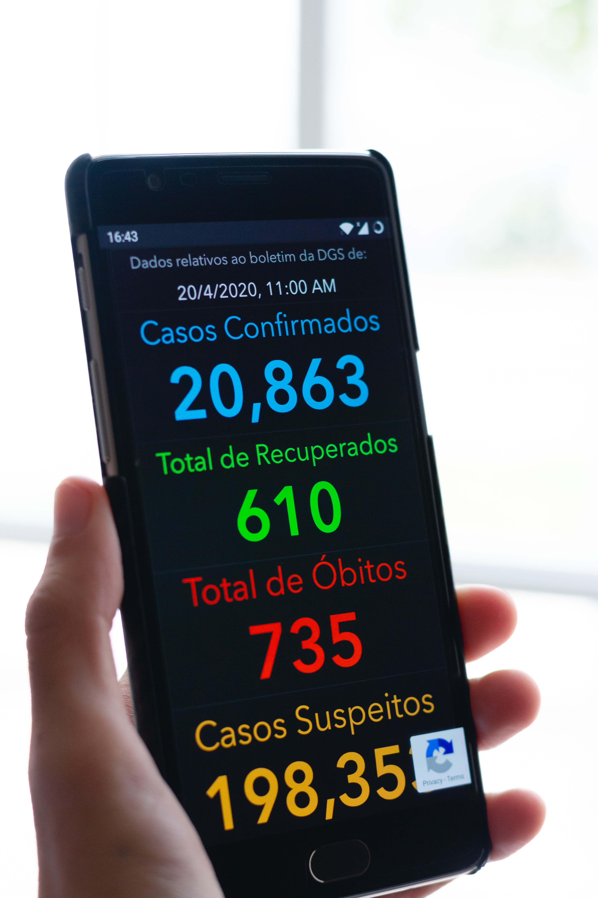

```{r setup, include=FALSE}
knitr::opts_chunk$set(echo = TRUE)
```



## 1.0 Introdução
Várias são as vezes que, somos confrontandos com actividades rotineiras cuja solução passa por automatizá-las. No mundo de programação e desenvolvimento de software surge um princípio bastante valioso: **"Don't Repeat Yourself (DRY)"**. *DRY* consiste em reduzir a repetição de tarefas evitando deste modo redundância, substituindo com a **abstracção**. Em outras palavras, temos que evitar realizar tarefas repetitivas, como o **copy & paste** o que dificulta bastante no acto de manutenção, compreensão e leitura do código.

Por exemplo, no contexto do COVID-19, onde temos que avaliar a evolução de número de casos confirmados ao longo do tempo por país, então criar um **template** para a visualização gráfica dos dados é a solução mais lógica. Por isso, vou aqui mostrar como criar função em **código R** para visualização de dados usando a **base de dados coronavirus**.

## 2.0 Análise Descritiva de Dados
 
### 2.1 Preparação dos dados
Para apresentação dos dados será usado o pacote **R Package ‘coronavirus’** que contém dados com actualização diária, sob a responsabilidade de, **Data source: Johns Hopkins University Center for Systems Science and Engineering (JHU CCSE) Coronavirus https://systems.jhu.edu/research/publichealth/ncov/**.

```{r}
# carregar os pacotes necessários
library(coronavirus)
library(tidyverse)
library(pander) # for formating in R Markdown
library(highcharter) # for visualization
```

Vamos carregar e examinar os dados:
```{r}
# carregar os dados
coronavirus <- read.csv(file = "https://raw.githubusercontent.com/ulklc/covid19-timeseries/master/countryReport/raw/rawReport.csv", stringsAsFactors = F)

coronavirus %>% glimpse()
```

Vamos converter a variável **day** de tipo *character()* para *date()* e alterar o seu nome para **date**.
```{r}
# converter os tipos de dados
coronavirus$day <- as.Date(coronavirus$day, '%Y/%m/%d')

# renomear o nome da coluna/variavel
colnames(coronavirus)[1] <- 'date'

coronavirus %>% glimpse()
```

Para nos familiarizarmos com os dados vamos mostrar para caso de **Mozambique**.
```{r}
coronavirus %>% 
    filter(countryName == 'Mozambique') %>% 
    select(date, countryName, confirmed, recovered, death) %>% 
    tail() %>% 
    pander()
```

### 2.2 Obter valores Totais de Casos

Vamos criar um *dataframe* para armazenar os valores totais dos casos **confirmado, recuperados, mortos e activos**. O que facilitará a obtenção de percentagem para cada caso.  

Esses dados serão usados como *InfoCard* na aplicação desenvolvida em **R Shiny**, https://rzezela.shinyapps.io/COVID19/.

```{r}
# obter valores totais de casos confirmado, recuperados, mortos e activos por pais

dataframeTotal <- coronavirus %>% 
    dplyr::group_by(countryName) %>%
    slice(n()) %>%
    ungroup() %>%
    dplyr::mutate(Unrecovered = confirmed - ifelse(is.na(recovered), 0, recovered) - ifelse(is.na(death), 0, death)) %>%
    dplyr::arrange(-confirmed) %>%
    dplyr::ungroup() %>%
    select(-c(date,region,lat,lon)) 
```


Como exemplo, podemos extrair os totais de alguns paises.
```{r}
# seleccionar valores totais de casos confirmado, recuperados, mortos e activos por pais

dataframeTotal %>% 
    filter(countryName %in% c('Mozambique', 'South Africa', 'Angola', 'Portugal', 'Brazil')) %>% 
    pander()
```

Podemos explorar a função **count()** para contar qualquer variável de interesse, por exemplo o número de paises com menos de $1000$ casos confirmado.

```{r}
No_country <- dataframeTotal %>% 
    filter(confirmed < 1000) %>% 
    count() %>% 
    pull() %>% 
    as.integer()

No_country
```


### 2.3 Analisar Casos Confirmados ao longo do tempo

Para avaliar a variação dos casos ao longo do tempo vamos criar uma tabela que regista diariamente as variações dos casos por país.
```{r}
# Casos confirmado ao longo do tempo: novos casos por pais

NewCases_tbl <- 
coronavirus %>% 
    # filter(countryName == 'Mozambique') %>% 
    filter(confirmed > 0) %>% 
group_by(countryName) %>%
    mutate(
        recovered = case_when(
            is.na(recovered) ~ lag(recovered),
            TRUE ~ recovered
        ),
        confirmed = case_when(
            is.na(confirmed) ~ lag(confirmed),
            TRUE ~ confirmed
        ),
        death = case_when(
            is.na(death) ~ lag(death),
            TRUE ~ death
        ),
        Active = as.numeric(confirmed) - as.numeric(death) - as.numeric(recovered)
    ) %>%
    mutate(NewConfirmed = case_when(
        !is.na(lag(as.numeric(confirmed))) ~ abs(as.numeric(confirmed) - lag(as.numeric(confirmed))),
        TRUE ~ 0),
        NewRecovered = case_when(
            !is.na(lag(as.numeric(recovered))) ~ abs(as.numeric(recovered) - lag(as.numeric(recovered))),
            TRUE ~ 0),
        NewDeaths = case_when(
            !is.na(lag(as.numeric(death))) ~ abs(as.numeric(death) - lag(as.numeric(death))),
            TRUE ~ 0)
        # ,change = case_when(
        #     !is.na(lag(as.numeric(active))) ~ abs(as.numeric(active) - lag(as.numeric(active))),
        #     TRUE ~ 0)
        ) %>% 
    ungroup()

# criar variavel Taxa de Mortalidade
NewCases_tbl$Death_Rate <- round((NewCases_tbl$death/NewCases_tbl$confirmed)*100, 2)


```

Como sempre, fazemos os devidos testes sobre os resultados das tabelas criadas.
```{r}
NewCases_tbl %>% 
    filter(countryName == 'Mozambique') %>% 
    select(-c(countryCode, 'region', 'lat', 'lon')) %>% 
    tail() %>% 
    pander()
```


## 3.0 Criar Visualizações dos Dados

Para facilitar o processo de manutenção, alteração ou modificação do código vamos criar funções. Portanto, criar funções tem inúmeras e inquestionáveis vantagens, desde a manutenção do módulo/projecto e a sua repetitividade. Em outras palavras, se tivermos que actualizar o nosso código, fazemos em apenas um só local, na função e os seus efeitos se propagam para todos os pontos onde está é invocada ou chamada.

### 3.1 Criar Funções para apresentação gráfica
O nosso foco é criar funções para mostrar as visualizações de dados. Assim, vamos mostrar graficamente como os casos de COVID-19, variam ao longo de tempo por país. Nesse sentido, usar uma função é o método mais eficiente e eficaz, isto é vamos usar o **nome do país como parâmetro de entrada, o input**.  
Para o efeito, criamos funções para **visualizar novos casos e acumulados diariamente**, bem como a **taxa de mortalidade**. Aqui estão as funções:
```{r}
# 3.1.1 criar função para mostrar novos casos e acumulados diariamente ----------------------------

hc_plot_NewCases <- function(data, countryName, cumulative = FALSE){
    
    dataset <- data
    
    v_countryName <- as.character(countryName)
    
    if (cumulative){
        
        plot_data <- dataset %>% 
            # filter by Country Name
            # filter(str_detect(ORIGIN_CITY_NAME, "New York"))
            filter(str_detect(countryName, v_countryName)) %>% 
            select(date, countryName, confirmed, recovered, death)
        
        v_confirmed <- plot_data$confirmed
        v_recovered <- plot_data$recovered
        v_deaths <- plot_data$death
        
        v_title <- paste('Cumulative Cases per Day -', countryName)
        
        
    }else{
        
        plot_data <- dataset %>% 
            # filter by Country Name
            # filter(countryName == countryName) %>% 
            filter(str_detect(countryName, v_countryName)) %>% 
            select(date, countryName, NewConfirmed, NewRecovered, NewDeaths)
        
        v_confirmed <- plot_data$NewConfirmed
        v_recovered <- plot_data$NewRecovered
        v_deaths <- plot_data$NewDeaths
        
        v_title <- paste('New Cases per Day -', countryName)
        
    }
    
    
    hc_out <- highchart() %>% 
        hc_chart(type = 'column') %>% 
        hc_xAxis(categories = plot_data$date) %>% 
        hc_add_series(data = v_confirmed, name = 'Confirmed', dataLabels = list(enabled = TRUE)) %>%
        hc_add_series(data = v_recovered, name = 'Recovered') %>% 
        hc_add_series(data = v_deaths, name = 'Deaths') %>% 
        highcharter::hc_title(text = v_title) %>%
        hc_tooltip(crosshairs = TRUE, shared = TRUE) %>% 
        hc_add_theme(hc_theme_flat() ) %>% 
        hc_exporting(enabled = TRUE)
        # hc_add_theme(hc_theme_ffx() ) %>% 
        # hc_add_theme(hc_theme_flat())
        # hc_add_theme(hc_theme_sandsignika() )
        # hc_add_theme(hc_theme_538() )
    
    return(hc_out)
    
    
}


# 3.1.2 criar função para mostrar a Taxa de Mortalidade diária ------------------------

# função para mostrar a Taxa de Mortalidade
hc_plot_DeathsRate <- function(data = NewCases_tbl, countryName = 'South Africa'){
    
    v_countryName = countryName
    
    v_title <- paste('Case Fatality Rate -', v_countryName)
    
    plot_data <- 
        NewCases_tbl %>% 
        # filter(countryName == 'South Africa') %>% 
        filter(str_detect(countryName, v_countryName)) %>% 
        select(date, countryName, confirmed, death, Death_Rate) 
    
    
    hc_out <- highchart() %>% 
        # hc_chart(type = 'area') %>% 
        hc_xAxis(categories = plot_data$date) %>% 
        hc_add_series(data = plot_data, 
                      type = 'area',
                      hcaes(y = Death_Rate),
                      name = 'Case Fatality Rate', dataLabels = list(enabled = TRUE)) %>% 
        highcharter::hc_title(text = v_title) %>%
        hc_yAxis(plotLines = list(list(
            value = round(mean(plot_data$Death_Rate, na.rm = TRUE), 2),
            color = "green",
            width = 2,
            dashStyle = "shortdash",
            label = list ( text = 'Average') 
        )),
        labels = list(format = '{value}%') 
        ) %>% 
        hc_tooltip(table = TRUE, sort = TRUE, borderWidth = 1,
                   pointFormat='<br>
               Rate: <b> {point.Death_Rate}% </b><br>
               Deaths: <b> {point.death:,0f} </b><br>
             Confirmed: <b> {point.confirmed:,0f} </b>'
        ) %>% 
        # hc_add_theme(hc_theme_sandsignika() )
         hc_add_theme(hc_theme_flat()) %>% 
        hc_exporting(enabled = TRUE)
    
    return(hc_out)
    
    
}
```

### 3.2 Usar Funções para apresentação gráfica

Agora, vamos usar as funções já criadas para mostrar graficamente as variações de casos confirmados diariamente por país. Como sempre, vamos realizar os testes para validar os *outputs* das funções criadas.  
Consideremos os casos para os seguintes paises:  
1. Mozambique  
2. South Africa  
3. Angola  
4. Portugal  
5. Brazil.  


```{r}
par(mfrow = c(5, 2))


# Novos casos por dia por país
hc_plot_NewCases(data = NewCases_tbl, countryName = 'Mozambique', cumulative = FALSE)

# Casos acumulados por dia por país
hc_plot_NewCases(data = NewCases_tbl, countryName = 'Mozambique', cumulative = TRUE)

# Novos casos por dia por país
hc_plot_NewCases(data = NewCases_tbl, countryName = 'South Africa', cumulative = FALSE)

# Casos acumulados por dia por país
hc_plot_NewCases(data = NewCases_tbl, countryName = 'South Africa', cumulative = TRUE)

# Novos casos por dia por país
hc_plot_NewCases(data = NewCases_tbl, countryName = 'Angola', cumulative = FALSE)

# Casos acumulados por dia por país
hc_plot_NewCases(data = NewCases_tbl, countryName = 'Angola', cumulative = TRUE)

# Novos casos por dia por país
hc_plot_NewCases(data = NewCases_tbl, countryName = 'Portugal', cumulative = FALSE)

# Casos acumulados por dia por país
hc_plot_NewCases(data = NewCases_tbl, countryName = 'Portugal', cumulative = TRUE)

# Novos casos por dia por país
hc_plot_NewCases(data = NewCases_tbl, countryName = 'Brazil', cumulative = FALSE)

# Casos acumulados por dia por país
hc_plot_NewCases(data = NewCases_tbl, countryName = 'Brazil', cumulative = TRUE)
```


### 3.2.2 Visualização de Casos: Taxa de Mortalidade

```{r}
par(mfrow = c(2, 3))

# Taxa de Mortalidade
hc_plot_DeathsRate(data = NewCases_tbl, countryName = 'Mozambique')

# Taxa de Mortalidade
hc_plot_DeathsRate(data = NewCases_tbl, countryName = 'South Africa')

# Taxa de Mortalidade
hc_plot_DeathsRate(data = NewCases_tbl, countryName = 'Angola')

# Taxa de Mortalidade
hc_plot_DeathsRate(data = NewCases_tbl, countryName = 'Portugal')

# Taxa de Mortalidade
hc_plot_DeathsRate(data = NewCases_tbl, countryName = 'Brazil')
```

## 4.0 Discussão
Há muito mais visualizações por desenvolver relacionado com **COVID-19**. Contudo, o meu objectivo visa melhorar e elevar a qualidade do nosso trabalho, tornando o processo eficiente e eficaz. Deste modo, aumentamos a nossa produtividade.

Portanto, **"Don't Repeat Yourself"**. 

Veja o resultado final da aplicação usando **R Shiny** para esse conjunto de dados, https://rzezela.shinyapps.io/COVID19/. Recomendo bastante o uso desta ferramenta, **R Shiny** para apresentar os resultados de suas análises, porque hoje as empresas procuram por **Aplicações** e não *Reports*. As aplicações permitem a iteractidade com o utilizador.


## 5.0 Conclusão

Podemos evitar tarefas repetitivas, enfadonhas, tediosas e rotineiras adoptando **automação e simplificação de processos**. Portanto, aqui apenas pretendo demonstrar como isso pode ser implementado em **código R** para visualização de dados.

**Estamos Juntos!**  
https://rzezela.shinyapps.io/COVID19/  
https://www.linkedin.com/in/reinaldo-zezela-11404433/  


